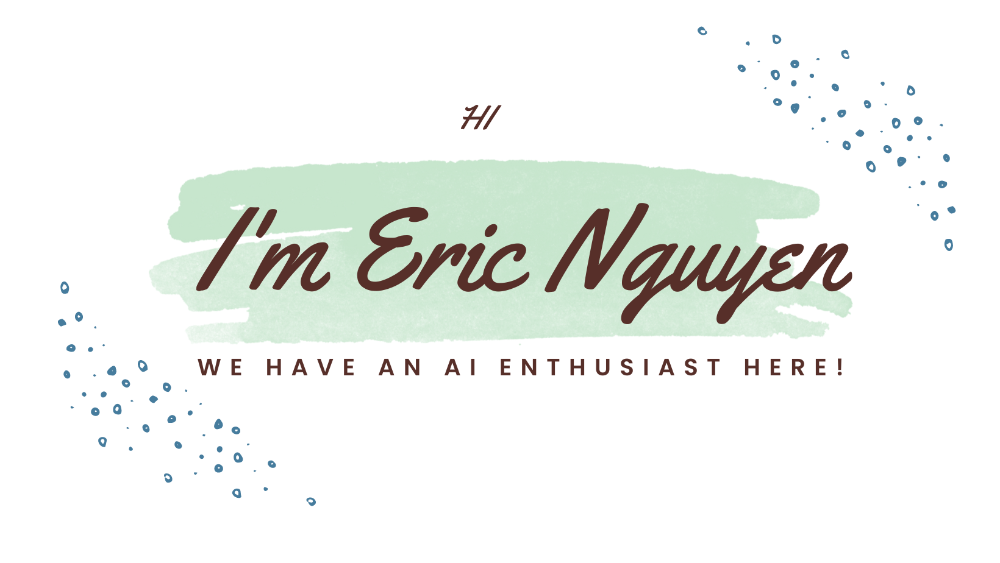

 

I'm Huy(Eric) from Viet Nam .I am a Junior Scientist who is interested in the following topics: Deep Learning, Robotics(ROS), and Computer Vision.

**About me**
- A Junior Scientist at AIT Austrian Institute of Technology.
- PhD student at TU Wien.
- 💼 ERASMUS MUNDUS JOINT MASTER in Intelligent Field Robotic Systems at Universitat de Girona (UdG, Spain), the Eötvös Loránd University (ELTE, Hungary).

- 💬 Ask me about anything [here](https://github.com/Eric-nguyen1402/Eric-nguyen1402/issues)
- [ LinkedIn](https://www.linkedin.com/in/hoang-huy-eric-nguyen-6b0653199/)

<code></code>
<code></code>   

 
 

<a href="https://github.com/Eric-nguyen1402/Language-driven-closed-loop-grasping">
  <!-- Change the `github-readme-stats.anuraghazra1.vercel.app` to `github-readme-stats.vercel.app`  -->
  
</a>

<a href="https://github.com/Eric-nguyen1402/closedloop.github.io">
  <!-- Change the `github-readme-stats.anuraghazra1.vercel.app` to `github-readme-stats.vercel.app`  -->
  
</a>    

<a href="https://github.com/Eric-nguyen1402/autonomous-navigation.github.io">
  <!-- Change the `github-readme-stats.anuraghazra1.vercel.app` to `github-readme-stats.vercel.app`  -->
  
</a>    

<a href="https://github.com/Eric-nguyen1402/realtime-2d-pose-estimation.github.io">
  <!-- Change the `github-readme-stats.anuraghazra1.vercel.app` to `github-readme-stats.vercel.app`  -->
  
</a>
<a href="https://github.com/Eric-nguyen1402/kinematic-control-system.github.io">
  <!-- Change the `github-readme-stats.anuraghazra1.vercel.app` to `github-readme-stats.vercel.app`  -->
  
</a>    

<a href="https://github.com/Eric-nguyen1402/pose-based-EKF-slam.github.io">
  <!-- Change the `github-readme-stats.anuraghazra1.vercel.app` to `github-readme-stats.vercel.app`  -->
  
</a>

<a href="https://github.com/Eric-nguyen1402/turtlebot3_multi_robot">
  <!-- Change the `github-readme-stats.anuraghazra1.vercel.app` to `github-readme-stats.vercel.app`  -->
  
</a>

